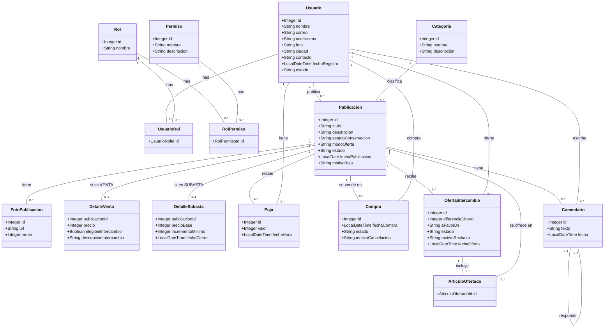

```mermaid
classDiagram
    class Usuario {
        +Integer id
        +String nombre
        +String correo
        +String contrasena
        +String foto
        +String ciudad
        +String contacto
        +LocalDateTime fechaRegistro
        +String estado
    }

    class Rol {
        +Integer id
        +String nombre
    }

    class Permiso {
        +Integer id
        +String nombre
        +String descripcion
    }

    class UsuarioRol {
        +UsuarioRolId id
    }

    class RolPermiso {
        +RolPermisoId id
    }

    class Categoria {
        +Integer id
        +String nombre
        +String descripcion
    }

    class Publicacion {
        +Integer id
        +String titulo
        +String descripcion
        +String estadoConservacion
        +String modoOferta
        +String estado
        +LocalDate fechaPublicacion
        +String motivoBaja
    }

    class FotoPublicacion {
        +Integer id
        +String url
        +Integer orden
    }

    class DetalleVenta {
        +Integer publicacionId
        +Integer precio
        +Boolean elegibleIntercambio
        +String descripcionIntercambio
    }

    class DetalleSubasta {
        +Integer publicacionId
        +Integer precioBase
        +Integer incrementoMinimo
        +LocalDateTime fechaCierre
    }

    class Puja {
        +Integer id
        +Integer valor
        +LocalDateTime fechaHora
    }

    class Compra {
        +Integer id
        +LocalDateTime fechaCompra
        +String estado
        +String motivoCancelacion
    }

    class OfertaIntercambio {
        +Integer id
        +Integer diferenciaDinero
        +String aFavorDe
        +String estado
        +String motivoRechazo
        +LocalDateTime fechaOferta
    }

    class ArticuloOfertado {
        +ArticuloOfertadoId id
    }

    class Comentario {
        +Integer id
        +String texto
        +LocalDateTime fecha
    }

    Usuario "1" -- "0..*" UsuarioRol : has
    Rol "1" -- "0..*" UsuarioRol : has
    Rol "1" -- "0..*" RolPermiso : has
    Permiso "1" -- "0..*" RolPermiso : has

    Usuario "1" -- "0..*" Publicacion : publica
    Categoria "1" -- "0..*" Publicacion : clasifica
    Publicacion "1" -- "0..*" FotoPublicacion : tiene
    Publicacion "1" -- "0..1" DetalleVenta : si es VENTA
    Publicacion "1" -- "0..1" DetalleSubasta : si es SUBASTA

    Publicacion "1" -- "0..*" Puja : recibe
    Usuario "1" -- "0..*" Puja : hace
    Publicacion "1" -- "0..*" Compra : se vende en
    Usuario "1" -- "0..*" Compra : compra

    Publicacion "1" -- "0..*" OfertaIntercambio : recibe
    Usuario "1" -- "0..*" OfertaIntercambio : oferta
    OfertaIntercambio "1" -- "1..*" ArticuloOfertado : incluye
    Publicacion "1" -- "0..*" ArticuloOfertado : se ofrece en

    Publicacion "1" -- "0..*" Comentario : tiene
    Usuario "1" -- "0..*" Comentario : escribe
    Comentario "0..1" -- "0..*" Comentario : responde
```
